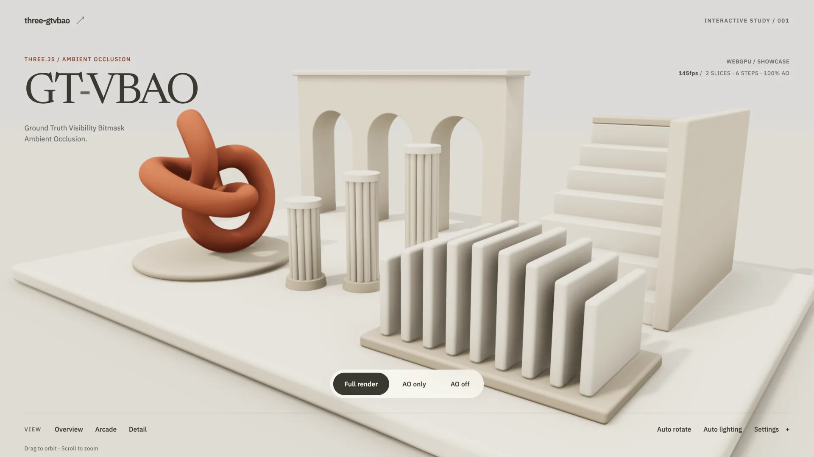

# three-gtvbao



**[English](README.md) | 日本語**

[three.js](https://threejs.org/) の WebGPU / WebGL2 向け GT-VBAO スクリーンスペース・アンビエントオクルージョン。TSL で書かれています。

three.js の `SSGINode` の AO 経路と `DenoiseNode` をベースに、Mirko Salm の GT-VBAO 補正を取り込んでいます。
`builtinAOContext` と `RenderPipeline` を通じて間接光に AO を適用します。

- コサイン重み付きセクターと透視補正したスライス方向による Visibility Bitmask AO。
- 線形深度 MIP、低解像度描画、深度考慮アップサンプルで輪郭のにじみを軽減。
- TRAA と組み合わせるテンポラルサンプリング、またはエッジ保存デノイザと組み合わせる固定サンプリング。
- 5 種類の品質プリセット、デバッグビュー、TypeScript 型定義。
- Tree shaking に対応したネイティブ ESM。必要な名前付きエクスポートだけをインポートできます。実行時オプションでバンドル内のコードが除去されるわけではありません。

## デモ

[デモを開く](https://norio.github.io/three-gtvbao/)と、プリセットや AO の設定を試せます。
実際のバックエンド名が表示されます。[WebGL2 を強制するデモ](https://norio.github.io/three-gtvbao/?backend=webgl)も利用できます。

## 要件

- three.js **r184** 以上 (`three/webgpu` と `three/tsl`)。
- `WebGPURenderer` の WebGPU / WebGL2 バックエンド。従来の `WebGLRenderer` は非対応です。
- WebGL2 を使う場合は `EXT_color_buffer_float`。
- `PerspectiveCamera`。

## インストール

```bash
npm install three three-gtvbao
```

## クイックスタート

初期化済みの `WebGPURenderer`、`scene`、透視投影の `camera` を用意してください。
不透明プリパスが深度と法線を出力し、ライティングパスが `MeshStandardNodeMaterial` など
three.js の AO フックを使うマテリアルに AO を適用します。Unlit マテリアルには影響しません。

```js
import * as THREE from "three/webgpu";
import { builtinAOContext, mrt, normalView, pass, positionView, screenUV, velocity } from "three/tsl";
import { traa } from "three/examples/jsm/tsl/display/TRAANode.js";
import { gtvbao, applyGtvbaoPreset, renderPassAfter, createPassthroughAoContext } from "three-gtvbao";

// 1. Opaque pre-pass: depth, view-space normals and velocity for TRAA.
const prePass = pass(scene, camera);
prePass.transparent = false;
prePass.setMRT(mrt({ output: normalView, velocity }));
prePass.contextNode = createPassthroughAoContext();
const preNormal = prePass.getTextureNode("output");
const preDepth = prePass.getTextureNode("depth");
const preVelocity = prePass.getTextureNode("velocity");

// 2. AO reads the completed pre-pass.
const aoNode = gtvbao(preDepth, preNormal, camera);
applyGtvbaoPreset(aoNode, "Balanced");
renderPassAfter(aoNode, prePass);

// 3. Apply AO at each lit fragment's surface.
const scenePass = pass(scene, camera);
renderPassAfter(scenePass, prePass);
scenePass.contextNode = builtinAOContext(
  aoNode.createDepthAwareAo(aoNode.getTextureNode(), {
    screenUv: screenUV,
    viewPosition: positionView,
    viewNormal: normalView,
  })
);

// 4. Resolve temporal sampling with TRAA.
const pipeline = new THREE.RenderPipeline(renderer);
pipeline.outputNode = traa(scenePass, preDepth, preVelocity, camera);
aoNode.setVariantChangeCallback(() => {
  pipeline.needsUpdate = true;
});

renderer.setAnimationLoop(() => pipeline.render());
```

`renderPassAfter` とプリパスの `createPassthroughAoContext()` は省略しないでください。
深度入力を先に用意し、ライティングパスの AO フックがプリパスに影響するのを防ぎます。
変種変更のコールバックは、設定変更でシェーダーが再コンパイルされる際にパイプラインを更新します。

### テンポラルアンチエイリアシングを使わない場合

描画ループを開始する前に `No Temporal` プリセットを適用し、デノイズ済みテクスチャを
ライティングパスに渡して、TRAA の出力をシーンパスに置き換えてください。

```js
import { gtvbaoDenoise } from "three-gtvbao";

const denoiseNode = gtvbaoDenoise(aoNode.getTextureNode(), preDepth, preNormal, camera, {
  linearDepthSource: aoNode,
});
renderPassAfter(denoiseNode, aoNode);
applyGtvbaoPreset(aoNode, "No Temporal Low", denoiseNode);

scenePass.contextNode = builtinAOContext(
  aoNode.createDepthAwareAo(denoiseNode.getTextureNode(), {
    screenUv: screenUV,
    viewPosition: positionView,
    viewNormal: normalView,
  })
);
pipeline.outputNode = scenePass;
```

## プリセット

| プリセット | 解像度倍率 | スライス × ステップ | テンポラル | デノイズ |
| --- | --- | --- | --- | --- |
| `Low` | 0.5 | 1 × 8 | あり | なし |
| `Balanced` | 0.5 | 2 × 6 | あり | なし |
| `High` | 1 | 3 × 12 | あり | なし |
| `No Temporal Low` | 0.5 | 2 × 6 | なし | あり |
| `No Temporal High` | 1 | 3 × 12 | なし | あり |

`applyGtvbaoPreset(aoNode, presetOrName, denoiseNode?)` は設定を適用し、適用したプリセットを返します。
描画グラフの接続は行いません。テンポラル系には TRAA などのテンポラル処理が必要で、
デノイズ系には上記のようにデノイザ出力を接続する必要があります。
`DEFAULT_GTVBAO_PRESET` は `"Balanced"` です。利用できる名前と設定は
`GTVBAO_PRESET_NAMES` と `GTVBAO_PRESETS` にあります。

## API

### `gtvbao(depthNode, normalNode, camera, options?)`

`new GTVBAONode(...)` でも作成できます。プリパスの深度テクスチャノード、view 空間法線の
テクスチャノード (深度から法線を再構成する場合は `null`)、`PerspectiveCamera` を渡します。
対数深度バッファにも対応しています。`options` には下記プロパティの初期値を指定できます。

既定値はプリセット適用前のコンストラクタの値です。`plain` は直接代入し、`uniform` / `variant` は
`.value` で変更します。変種の変更でシェーダーが再構築されることがあり、`batchVariantChanges(fn)` で
1 回の再構築にまとめられます。`normalEncoding` は生成時に指定してください。

| プロパティ | 種別 | 既定値 | 説明 |
| --- | --- | --- | --- |
| `resolutionScale` | plain | `1` | 描画バッファに対する AO の解像度倍率。 |
| `sliceCount` | variant | `2` | ピクセルあたりのスライス数 (1〜8)。 |
| `stepCount` | variant | `8` | 方向あたりのステップ数 (1〜32)。ピクセルあたり最大 `sliceCount × stepCount × 2` サンプル。 |
| `radius` | uniform | `3` | サンプリング半径の調整値。既定では画面相対、`useScreenSpaceSampling` が false の場合はワールド空間。 |
| `useScreenSpaceSampling` | variant | `true` | ワールド空間ではなく画面相対のサンプリング半径を使う。 |
| `thickness` | uniform | `0.12` | 深度によるスケーリングとクランプ前の、遮蔽物の基準厚み (ワールド単位)。 |
| `useLinearThickness` | variant | `true` | サンプルの view 深度と `camera.far` の比で厚みをスケールする。 |
| `linearThicknessScale` | uniform | `100` | 深度でスケールした厚みに掛ける倍率。 |
| `maxThickness` | uniform | `0.35` | 実効厚みの上限。MIP プリフィルタの深度範囲にも使う。 |
| `aoIntensity` | variant | `1` | 可視率の指数。`1` の高速パスとの切り替え時だけ再構築する。 |
| `expFactor` | variant | `2` | ステップ分布の指数。`2` の高速パスとの切り替え時だけ再構築する。 |
| `sectorMeasure` | variant | `"cosine"` | セクターの重み付け。`"cosine"`、`"solidAngle"`、`"angle"`。下記参照。 |
| `usePerspectiveCorrectSlice` | variant | `true` | 視線ベクトルの周りにスライスを分布させ、画面に投影する。 |
| `useDepthMips` | variant | `true` | シーン深度の代わりに線形深度 MIP チェーンをサンプルする。 |
| `useDepthAwareUpsample` | plain | `true` | `resolutionScale < 1` かつ深度 MIP 有効時に、深度考慮アップサンプルを使う。 |
| `useTemporalFiltering` | plain | `true` | サンプルを毎フレーム回転させる。テンポラル処理が必要。 |
| `normalEncoding` | plain | `"view"` | 生の view 空間法線。`[0,1]` にパックした法線なら `"directionToColor"`。 |
| `debugMode` | variant | `0` | `GTVBAO_DEBUG_MODE_OPTIONS` から表示を選ぶ。 |

| メソッド | 説明 |
| --- | --- |
| `getTextureNode()` | AO テクスチャ。深度考慮アップサンプルには `createDepthAwareAo` を使う。 |
| `createDepthAwareAo(aoTexture, { screenUv, viewPosition, viewNormal })` | ライティング側フラグメント自身の `positionView` と `normalView` で AO をサンプルする。 |
| `createDepthAwareAoFromBuffers(aoTexture, depthTexture, normalTexture, screenUv)` | 全画面パス向けの同等処理。バッファから表面を再構成する。 |
| `getDepthMipNodes()` | 線形深度テクスチャ 5 枚。レベル 0 は AO 解像度。深度 MIP 有効時だけ更新される。 |
| `isDepthAwareUpsampleActive()` | 低解像度と現在の設定により深度考慮アップサンプルが有効かを返す。 |
| `setVariantChangeCallback(fn)` | 上記のパイプライン更新コールバックを登録する。 |
| `batchVariantChanges(fn)` | 複数の変種変更を 1 回の再構築にまとめる。 |
| `setSize(width, height)` | 描画バッファサイズで自動的に呼ばれる。 |
| `dispose()` | ノードの描画先、マテリアル、深度プリフィルタを解放する。 |

### `gtvbaoDenoise(aoTexture, depthNode, normalNode, camera, options?)`

`new GTVBAODenoiseNode(...)` でも作成できます。AO 解像度で動く 16 タップのエッジ保存デノイザです。
`getTextureNode()` が出力を返し、`dispose()` がリソースを解放します。

`radius` (AO テクセル単位)、`lumaPhi`、`depthPhi`、`normalPhi` は `.value` で変更します。
オプションは `normalEncoding`、`linearDepthSource` (線形深度を再利用する AO ノード)、
`useTemporalDenoiseRotation` (カーネルを毎フレーム回転。テンポラル処理との併用時のみ) です。

### パス順序とエクスポート

`renderPassAfter(passNode, dependency)` は毎フレーム依存先を先に描画します。
`createPassthroughAoContext()` は不透明プリパスをライティングパスの AO コンテキストから分離します。
配置はクイックスタートを参照してください。

デバッグヘルパー、セクターの測度、タイムスタンプ計測用のレンダーパス名を含む全エクスポートは、
[src/index.js](src/index.js) と [TypeScript 型定義](src/index.d.ts) を参照してください。

## アルゴリズムと制限

各スライスは遮蔽された方向を 32 bit マスクに記録します。GT-VBAO は量子化前にホライズン角をリマップし、
セクター両端に共通のディザを使い、ピクセルごとの視線ベクトルの周りにスライスを分布させます。
遮蔽されていないセクターから可視率を求め、コサイン重み付きスライスは積分値を重みとして合成します。

- `cosine` は GTAO 方式の重み付けで、カメラのピッチによる偏りを軽減します。`solidAngle` は立体角の
  重み付け、`angle` は元の VBAO と同じ等角度セクターを使います。
- 同じサンプル数では `cosine` のほうが暗部のノイズが多くなることがあります。ピッチによる偏りの軽減より
  低ノイズを優先する場合は `angle` を試してください。
- 画面内の深度を使うため、隠れた形状や画面外の形状は AO に寄与しません。
- 厚みは近似です。各サンプル自身の視線方向に沿った透視補正オフセットは未実装です。

## 開発

リポジトリを取得したディレクトリで Node.js **20+** を使います。

```bash
npm install
npm run dev
npm run typecheck
npm test
npm run build
```

Vite が表示するローカル URL (通常は `http://localhost:5173`) を開いてください。[サンプル](example/) には
実際のバックエンド名が表示されます。`?backend=webgl` を付けると WebGL2 を強制できます。アプリでは
`new THREE.WebGPURenderer({ forceWebGL: true })` を使います。指定しない場合は WebGPU が利用できないと WebGL2 が選ばれます。

`npm test` には tree shaking の検証も含まれます。単独で実行する場合は `npm run test:treeshake` を使います。
ブラウザでの GPU 検証は別途実施します。[WebGPU / WebGL2 回帰テスト](test/webgpu/README.md) を参照してください。

サンプルは `master` への push 後に [GitHub Actions](.github/workflows/ci.yml) で
GitHub Pages に自動公開されます。Pages 向けのビルドコマンドは
`npm run build -- --base=/three-gtvbao/`、公開対象は `dist/` です。

## クレジット

- three.js の [`SSGINode.js`](https://github.com/mrdoob/three.js/blob/dev/examples/jsm/tsl/display/SSGINode.js)
  と `DenoiseNode.js` (MIT) がベースです。`SSGINode` は Olivier Therrien の
  [SSRT3](https://github.com/cdrinmatane/SSRT3) (MIT) の移植で、原論文は *Screen Space Indirect Lighting
  with Visibility Bitmask* (Therrien, Levesque, Gilet, 2023) です。
- GT-VBAO 補正: [Mirko Salm の Shadertoy](https://www.shadertoy.com/view/XXGSDd) (CC0 / MIT)。
- 深度 MIP プリフィルタ: Intel の [XeGTAO](https://github.com/GameTechDev/XeGTAO) (MIT)。

## ライセンス

[MIT](LICENSE)
